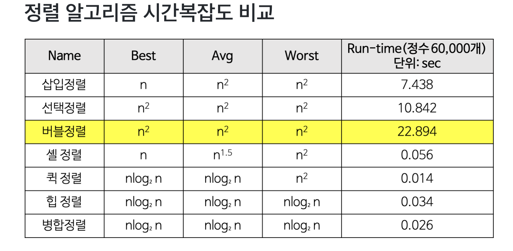

### 📚 버블 정렬
1. 버블 정렬로 오름차순 정렬

#### 🎯 정리
- 서로 인접한 두 원소를 검사하여 정렬하는 버블 정렬
- 장점은 구현이 매우 간단.
- 단점은 하나의 요소가 가장 왼쪽에서 오른쪽으로 이동하기 위해서는 배열에서 모든 다른 요소들과 교환되어야 한다. 특히 특정 요소가 최종 정렬 위치에 이미 있는 경우라도 교환되는 일이 일어난다.
- 버블 정렬의 시간복잡도
  - 비교 횟수
    - n - 1, n - 2, ... , 2, 1번 = n(n - 1) /2
  - 교환 횟수
    - 입력 자료가 역순으로 정렬되어 있는 최악의 경우, 한 번 교환하기 위하여 3번의 이동이 필요하므로 3n(n - 1)/2
    - 입력 자료가 이미 정렬되어 있는 최상의 경우, 자료 이동이 발생하지 않는다.
  - T(n) = O(n2)

